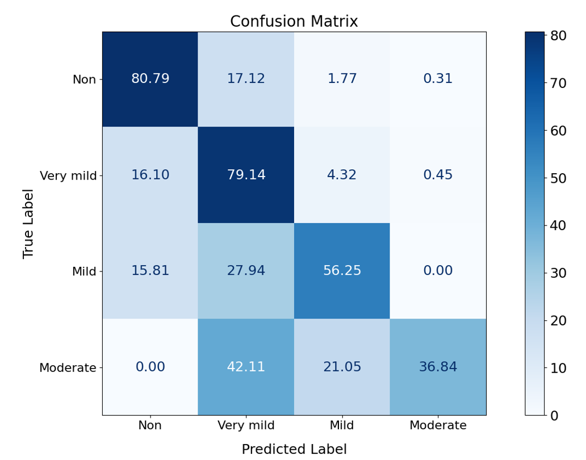
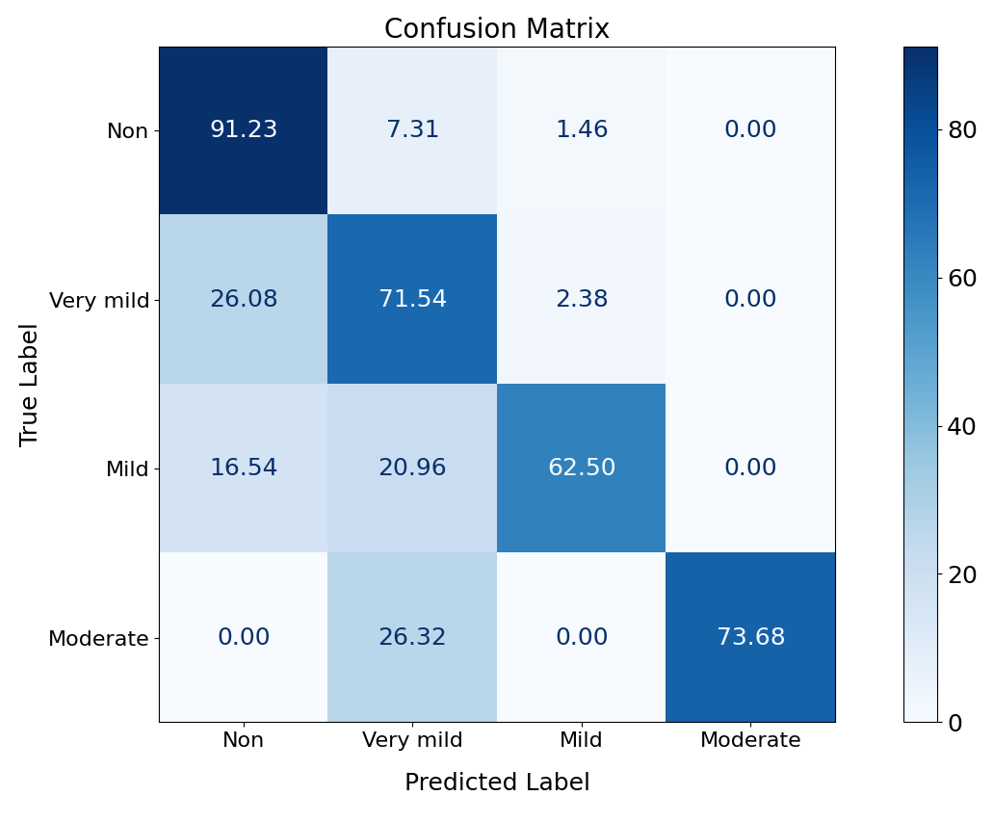
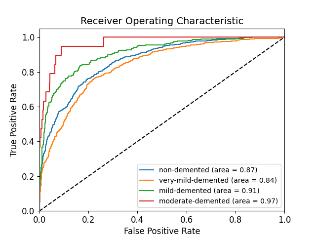
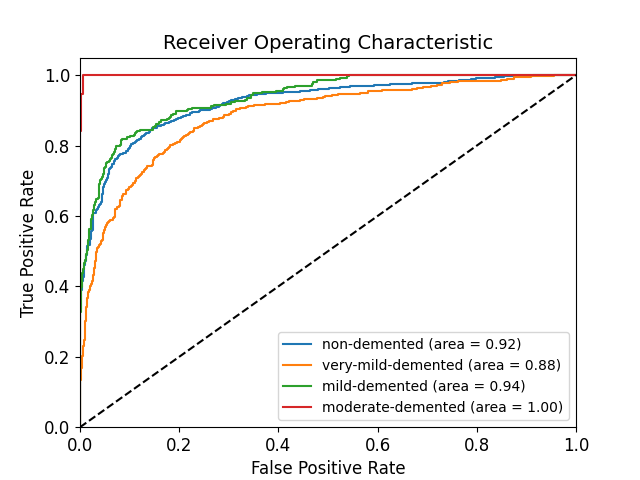

# Alzheimer’s Level Prediction Based on Brain MRI Images

## Overview
This work aims to predict the Alzheimer's level of patients based on brain MRI images. To achieve this goal, we used a proposed convolutional neural network (CNN) to classify the images into the four classes and compared the results with a ResNet.


## Table of Contents
- [Installation](#installation)
- [Data Description](#data-description)
- [Usage](#usage)
  - [Main Program](#main-program)
  - [Additional Scripts](#additional-scripts)
- [Results](#results)
- [Contributing](#contributing)
- [Thanks](#thanks)


## Installation
1. Clone this repository:
    ```sh
    git clone https://github.com/intel-comp-saude-ufes/2024-1-P2-alzheimers-level-prediction-based-on-brain-MRI-images
    cd 2024-1-P2-alzheimers-level-prediction-based-on-brain-MRI-images
    ```
2. Install the required Python packages:
    ```sh
    pip install -r requirements.txt
    ```

## Data Description
For this study, we chose to work with a bank of Brain MRI imaging data created by [SARVESH DUBEY](https://www.kaggle.com/datasets/tourist55/alzheimers-dataset-4-class-of-images), which contains 6400 images of size 176x208 pixels, divided between four classes that represent the levels Alzheimer's (<strong>Non demented</strong>, <strong>very mild demented</strong>, <strong>mild demented</strong> and <strong>moderate demented</strong>), totaling 36 MB of data. Also data augmentation was used in this same database for purposes comparison with the original data

## Usage
### Main Program
To run the main program, use the following command:
```sh 
python main.py
```

### Additional Scripts
- `aug.py`: This script is responsible for performing data augmentation on the images in the dataset.
- `cross-validation.py`: This script is responsible for performing cross-validation on the dataset.
- `plots.py`: This script is responsible for generating the confusion matrix and the ROC curve.

### Web page
To run a web page that you can upload an image and get the prediction, use the following command:
```
python main.py # Generate the model
cd web
python app.py
```


## Results

<div style="display: flex; justify-content: center;">
  <table>
    <tr>
      <td align="center">
        
        <br/>
        <b>Proposed CNN teste with original dataset</b>
      </td>
      <td align="center">
        
        <br/>
        <b>Proposed CNN teste with augmented dataset</b>
      </td>
    </tr>
    <tr>
      <td align="center">
        
        <br/>
        <b>Proposed CNN teste with original dataset</b>
      </td>
      <td align="center">
        
        <br/>
        <b>Proposed CNN teste with augmented dataset</b>
      </td>
    </tr>
  </table>
</div>

> A video sumarizing the hole project can be found [here](https://youtu.be/BeSnPn9pk00)

> The full article about this project can be found [here](https://drive.google.com/file/d/1ekWxY7Z-xIVdcyCoCvJ4tWM_8Un9U21P/view?usp=sharing)

## Contributing
Contributions are what make the open-source community such an amazing place to learn, inspire, and create. Any contributions you make are **greatly appreciated**.

1. Fork the Project
2. Create your Feature Branch (`git checkout -b feature/AmazingFeature`)
3. Commit your Changes (`git commit -m 'Add some AmazingFeature'`)
4. Push to the Branch (`git push origin feature/AmazingFeature`)
5. Open a Pull Request

## Thanks
Special thanks to the [Andre Georghton Cardoso Pacheco](https://github.com/paaatcha) for giving the opportunity to make this project happen.
